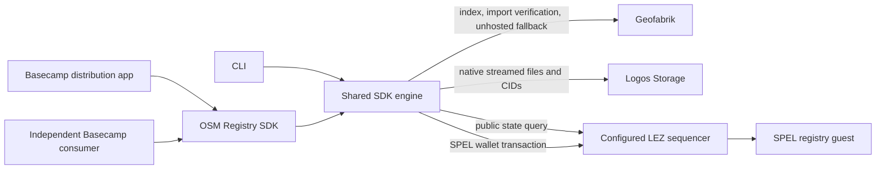

# Architecture and trust

The registry stores a bounded, Borsh-encoded `RegistryState`: a 32-byte signing authority followed by a length-prefixed JSON entry string. Every entry includes the mandatory metadata plus a SHA256 and byte count for validating a reconstructed stream. The public registry PDA is derived from the deployed program ID and literal seed `osm_registry_v1`. The SDK validates the account's program owner before decoding it and refuses unfamiliar LEZ account layouts.

The guest enforces the frozen partition, parent/level, canonical region-specific Geofabrik URL, CID/hash formats, version bounds, nonempty hosted data, uniqueness within a batch, immutable bytes for a snapshot version and non-regressing registration timestamps. It validates the entire batch before producing any post-state. The state account and its owner are verified by SPEL's generated constraints, and mutations require the initialization authority's signature.

**The registry is curated.** The curator verifies Geofabrik bytes off-chain before signing. The guest cannot prove that a supplied MD5 came from Geofabrik: Geofabrik does not sign snapshot metadata for LEZ. Accordingly, registry provenance is an attestation by the curator, while Storage's CID verifies content-addressed block integrity. This model prevents arbitrary callers from poisoning another region's metadata. Hosts using a shared registry need its signing authority; operators can deploy their own registry and configure the SDK accordingly. Multi-curator governance and permissionless provenance attestations are not implemented. This write-access limitation is called out in the self-assessment rather than presented as open registration for every operator.

Registry initialization is first-claim: deploy and initialize promptly using your own wallet; for a shared deployment verify the recorded authority. There is no administrator override or key-rotation instruction in this version. Losing the curator key requires a new deployment. Registration timestamps are curator-provided observation times, not a consensus clock. Snapshot version comparisons parse the canonical publication timestamp and match on the region's frozen extract path.

The registry retains the two newest snapshot versions per region and sorts query results by timestamp. State JSON is capped at 102,364 bytes so Borsh overhead remains within LEZ's 100 KiB account limit. Oversized batches/state fail explicitly. Large regions are streamed in 1 MiB HTTP chunks and 64 KiB native Storage blocks; hashes stream over the staged file. Bulk host prepares up to 72 entries, then uses one transaction. A JSON string argument avoids Linux's per-argument limits caused by decimal-encoding every payload byte.

Each node uses its own configured data directory. Do not point the SDK at Basecamp's active Storage repository. The native node must keep running to serve mirrored files; GUI workers persist, and CLI users run `serve` after host. Storage retention and disk quota are controlled by the native node's configuration. A successful upload/registration is not a promise of permanent availability if the operator shuts down or data expires.

MD5 verification happens when a snapshot enters the registry, using Geofabrik's published checksum over HTTPS. A local import is staged before hashing to prevent a caller changing the file during upload. When available, the source is pinned to the dated Geofabrik archive with the same publication timestamp; otherwise the `latest` source is retained and import verifies it stayed stable. Historical latest URLs may require archive lookup for later evaluator checks. Hosted downloads require no central checksum round trip: native Storage verifies the CID, and the SDK checks SHA256 and size locally before committing an output file. Unhosted downloads contact Geofabrik and verify MD5.

The only runtime network dependencies are the configured LEZ sequencer, Logos Storage peers and explicitly enabled Geofabrik operations. Build-time GitHub/Nix dependencies are tooling, not runtime backends. There is no relay, analytics or mandatory external indexer. Setting `geofabrik:false` leaves registry discovery, resolution and hosted download usable.
